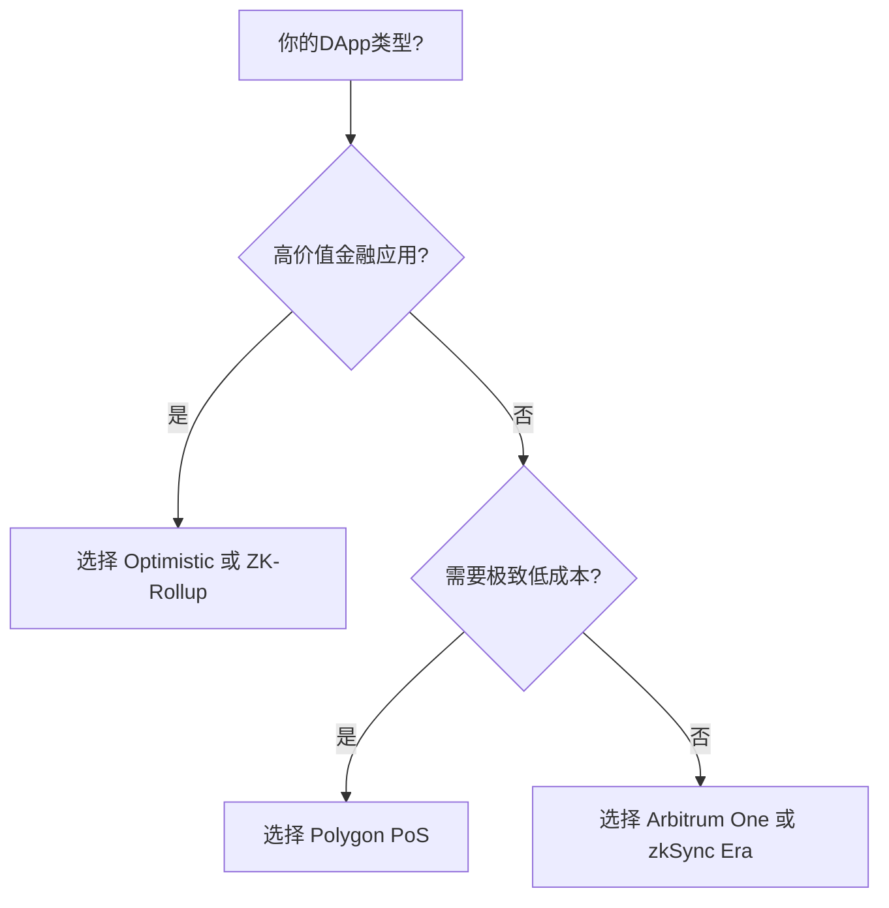

### **第13章：Layer 2 与扩展方案：提升性能的关键（2025年10月最新版）**

⚠️ 免责声明：本文档旨在提供教育性、参考性的技术指导，基于当前（2025年）社区广泛认可的最佳实践。它不构成任何形式的投资、法律或专业建议。智能合约开发风险极高，任何部署前都应进行严格的自我审查、自动化扫描和第三方审计。

以太坊主网的可扩展性瓶颈（高Gas费、低TPS）已成为Web3应用发展的主要障碍。**Layer 2（L2）** 技术通过将计算和交易执行移出主链，在保持以太坊安全性的同时，实现**百倍性能提升**。本章系统讲解主流L2方案，结合2025年最新生态、安全机制与生产级部署实践，确保内容**精准、无过时信息、可直接用于项目开发**。

---

#### **1. 为什么需要 Layer 2？**

##### **（1）以太坊主网的瓶颈（2025年现状）**
| 指标 | 主网（L1） | 问题 |
|------|------------|------|
| **平均Gas费** | 15–50 Gwei（高峰时 > 100 Gwei） | 普通转账成本 $1–$5 |
| **TPS（每秒交易）** | ~15–30 | 无法支持大规模应用 |
| **确认时间** | 12秒（一个区块） | 实时交互体验差 |
| **拥堵场景** | NFT Mint、DeFi 峰值 | Gas费飙升至$50+ |

> ✅ **结论**：**L1不适合作为大多数DApp的主战场**。必须使用L2降低成本、提升用户体验。

---

#### **2. 主流 Layer 2 方案对比（2025年）**

| 方案 | 类型 | 代表项目 | TPS | 安全模型 | 取款延迟 | EVM兼容性 |
|------|------|----------|-----|-----------|-----------|------------|
| **Optimistic Rollup** | 欺诈证明 | Arbitrum, Optimism | 2,000–4,000 | 依赖以太坊 | 7天（可桥接缩短） | 完全兼容 |
| **ZK-Rollup** | 零知识证明 | zkSync Era, StarkNet, Scroll | 5,000–10,000+ | 数学证明（更强） | 1–6小时 | 完全兼容（zkEVM） |
| **侧链** | 独立共识 | Polygon PoS | 7,000 | 独立验证者集（安全性较低） | 即时 | 完全兼容 |
| **Plasma** | 梅克尔树 | 已基本淘汰 | 低 | 依赖操作者诚实 | 长（7–14天） | 有限 |
| **状态通道** | 双方离线 | Raiden（已停更） | 极高 | 双方在线 | 即时 | 无 |

> ✅ **2025年推荐**：
> - **通用DApp** → **Arbitrum** 或 **Optimism**
> - **高性能需求（如DEX）** → **zkSync Era** 或 **StarkNet**
> - **低成本高频应用** → **Polygon PoS**（需接受稍低安全性）

---

#### **3. Rollups：核心机制详解**

##### **（1）Rollup 基本原理**
- **核心思想**：在L2执行交易，将**交易数据压缩后提交到L1**，由L1保障数据可用性和最终性。
- **两种安全模型**：
    - **Optimistic Rollup**：默认交易有效，允许7天内挑战（欺诈证明）。
    - **ZK-Rollup**：每次提交都附带**零知识证明（ZKP）**，数学上证明交易正确。

##### **（2）Optimistic Rollups：Arbitrum 与 Optimism**

###### **Arbitrum（2025年市场份额第一）**
- **Nitro 升级**：使用WASM执行环境，性能接近原生EVM。
- **交互式欺诈证明**：挑战过程更高效。
- **Nova 链**：基于AnyTrust DA（数据可用性），Gas极低，适合社交、游戏。

###### **Optimism（Bedrock 架构）**
- **OP Stack**：开源模块化框架，支持“超级链（Superchain）”愿景。
- **EIP-4844 支持**：使用**Blob Transactions**，Gas成本降低50–90%。
- **项目示例**：Uniswap、Aave、Synthetix 已部署。

###### **代码示例：通过 Ethers.js 连接 Arbitrum Sepolia**
```ts
import { ethers } from 'ethers';

// Arbitrum Sepolia 测试网
const provider = new ethers.JsonRpcProvider('https://sepolia-rollup.arbitrum.io/rpc');

// 获取余额
const balance = await provider.getBalance('0xAb...Cd');
console.log('Balance:', ethers.formatEther(balance), 'ETH');

// 发送交易（与L1语法一致）
const wallet = new ethers.Wallet('PRIVATE_KEY', provider);
const tx = await wallet.sendTransaction({
  to: '0x...',
  value: ethers.parseEther('0.01'),
  gasLimit: 21000
});

const receipt = await tx.wait();
console.log('Tx hash:', receipt?.hash);
```

> ✅ **优势**：**EVM完全兼容**，无需重写Solidity合约。

---

##### **（3）ZK-Rollups：zkSync、StarkNet**

###### **zkSync Era（Matter Labs）**
- **zkEVM**：兼容Solidity，开发者体验友好。
- **账户抽象（AA）原生支持**：支持智能钱包、Gas代付。
- **费用**：比L1低10–50倍。

###### **StarkNet（StarkWare）**
- **Cairo 语言**：非Solidity，学习曲线陡峭。
- **高吞吐**：适合高频交易、衍生品协议。
- **SHARP（Shared Prover）**：多个应用共享ZKP生成，降低成本。

###### **代码示例：部署合约到 zkSync Era（Hardhat）**
```bash
# 安装 zksync-ethers-v6
npm install -D hardhat @nomicfoundation/hardhat-toolbox zksync-ethers-v6
```

```js
// hardhat.config.ts
import { HardhatUserConfig } from "hardhat/config";
import "@nomicfoundation/hardhat-toolbox";
import "@matter-labs/hardhat-zksync-deploy";
import "@matter-labs/hardhat-zksync-solc";

const config: HardhatUserConfig = {
  zksolc: {
    version: "latest",
    compilerSource: "binary",
    settings: {}
  },
  networks: {
    zksync_testnet: {
      url: "https://sepolia.era.zksync.dev",
      ethNetwork: "sepolia",
      chainId: 300,
      zksync: true,
    },
  },
  solidity: {
    version: "0.8.26"
  }
};

export default config;
```

```ts
// 部署脚本（与标准Hardhat一致）
import { ethers } from "ethers";
import { Provider, Wallet } from "zksync-ethers";

async function deploy() {
  const provider = new Provider("https://sepolia.era.zksync.dev");
  const wallet = new Wallet("PRIVATE_KEY", provider);

  const factory = await wallet.getContractFactory("MyNFT");
  const contract = await factory.deploy();
  await contract.deployed();

  console.log("Contract deployed at:", contract.address);
}
```

> ✅ **优势**：**ZKP提供更强安全性**，无7天取款延迟。

---

#### **4. 侧链：Polygon PoS**

##### **（1）定位**
- **独立区块链**，使用PoS共识，通过**桥接**与以太坊连接。
- **非Rollup**，不向L1提交交易数据，安全性依赖自身验证者。

##### **（2）2025年状态**
- **TVL**：$1.2B，仍为重要生态。
- **用例**：游戏、社交、低价值高频交易。
- **风险**：若验证者合谋，可能盗取资产（理论风险）。

##### **（3）连接 Polygon PoS**
```ts
// Polygon Mumbai 测试网
const provider = new ethers.JsonRpcProvider('https://rpc-mumbai.maticvigil.com');
```

> ✅ **建议**：**非高价值应用可使用Polygon**，金融类应用优先选择Rollup。

---

#### **5. 状态通道与 Plasma（现状）**

- **状态通道**（如 Raiden）：需双方在线，复杂度高，**2025年已基本被L2取代**。
- **Plasma**（如 Loom Network）：取款延迟长，数据可用性问题，**已被Rollup淘汰**。

> ✅ **结论**：**开发者无需再关注 Plasma 和状态通道**，Rollup 是当前和未来的标准。

---

#### **6. 开发者建议：将 DApp 部署到 Arbitrum 或 Polygon 以降低成本**

##### **（1）部署决策树**


##### **（2）生产级部署步骤（以 Arbitrum One 为例）**

###### **步骤1：配置 Hardhat**
```js
// hardhat.config.js
module.exports = {
  solidity: "0.8.26",
  networks: {
    arbitrum: {
      url: "https://arb1.arbitrum.io/rpc",
      accounts: [process.env.PRIVATE_KEY],
      chainId: 42161
    }
  },
  etherscan: {
    apiKey: {
      arbitrumOne: process.env.ARBISCAN_API_KEY
    }
  }
};
```

###### **步骤2：编译并部署**
```bash
npx hardhat compile
npx hardhat run scripts/deploy.js --network arbitrum
```

###### **步骤3：验证合约**
```bash
npx hardhat verify --network arbitrum DEPLOYED_CONTRACT_ADDRESS
```

##### **（3）跨链桥接建议**
- **官方桥**：[Arbitrum Bridge](https://bridge.arbitrum.io)、[Optimism Gateway](https://app.optimism.io/bridge)
- **第三方**：Synapse、Stargate（支持多链）
- **Gas优化**：使用 **EIP-4844 + Blob** 降低Rollup成本。

---

### **本章小结**

截至2025年10月，L2格局已清晰：

| 方案 | 推荐场景 | 生产级选择 |
|------|----------|------------|
| **Optimistic Rollup** | 通用DeFi、NFT市场 | **Arbitrum One**, **Optimism** |
| **ZK-Rollup** | 高性能、高安全需求 | **zkSync Era**, **StarkNet** |
| **侧链** | 游戏、社交、低价值应用 | **Polygon PoS** |
| **Plasma/通道** | 已淘汰 | ❌ 不推荐 |

> ✅ **终极建议**：
> 1. **新项目默认部署到 Arbitrum 或 Optimism**。
> 2. **使用 EIP-4844 降低Rollup成本**。
> 3. **通过官方桥或LayerZero实现跨链互操作**。
> 4. **永远在测试网（如 Arbitrum Sepolia）验证后再上线**。
