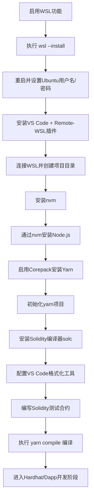

# Windows 系统下搭建 WSL + Ubuntu + Node.js + Solidity 开发环境全流程指南


## 一、安装 WSL（Windows Subsystem for Linux）
### 1. 系统要求
- **Windows 10 版本 2004 及以上**（Build 19041+）
- 或 **Windows 11**
- 64位系统

> 💡 提示：按 `Win + R` → 输入 `winver` 查看系统版本。

### 2. 以管理员身份打开终端
1. 按 `Win + X`
2. 选择 “终端（管理员）” 或 “PowerShell（管理员）”

### 3. 执行安装命令
```bash
wsl --install
```

> 📌 此命令会自动：
> - 启用 `Windows Subsystem for Linux`
> - 启用 `Virtual Machine Platform`
> - 安装默认发行版（通常是 **Ubuntu**）
> - 安装 WSL 2 内核更新包

### 4. 可选：安装指定 Linux 发行版
```bash
# 查看所有可用发行版
wsl --list --online

# 安装特定发行版（如 Debian）
wsl --install -d Debian
```

### 5. 重启电脑
安装完成后必须 **重启计算机**，系统将自动启动 Ubuntu 初始化流程。

### 6. 初始化 Ubuntu 子系统
重启后，Ubuntu 会自动启动，按提示完成以下操作：
1. 设置 **用户名**（如 `ubuntu`）
2. 设置 **密码**（输入时无回显，正常输入后回车确认）

> ⚠️ 注意：这个密码是 Linux 用户密码，与 Windows 登录密码无关。

### 7. 验证 WSL 安装状态
```bash
wsl --list --running
```
> ✅ 成功：终端显示当前运行的 Linux 发行版（如 `Ubuntu`）。

### ✅ 补充：若安装失败（手动启用功能）
如果 `wsl --install` 执行失败，按以下步骤手动启用：
1. 打开 **控制面板 → 程序 → 启用或关闭 Windows 功能**
2. 勾选以下两项：
   - ☑ 适用于 Linux 的 Windows 子系统
   - ☑ 虚拟机平台
3. 点击“确定” → 重启电脑
4. 重启后再次运行 `wsl --install`


## 二、配置 VS Code 与 WSL 联动开发
### 1. 安装 VS Code（若未安装）
- 下载地址：[https://code.visualstudio.com](https://code.visualstudio.com)
- 按向导完成安装，建议勾选“添加到 PATH”（便于终端启动）。

### 2. 安装 Remote Development 插件
1. 打开 VS Code
2. 进入扩展商店（快捷键：`Ctrl+Shift+X`）
3. 搜索并安装 **Remote Development**（Microsoft 官方提供，包含 `Remote-WSL` 核心功能）

### 3. 连接到 WSL 中的 Ubuntu
1. 按 `Ctrl + Shift + P` 调出命令面板
2. 输入并选择：`Remote-WSL: New Window`
3. 在弹出的列表中选择你的 Ubuntu 发行版
4. 等待片刻，新窗口将以 WSL 环境启动（底部状态栏显示 `WSL: Ubuntu`）

### 4. 在 WSL 中创建项目目录
在 VS Code 的 WSL 终端中执行以下命令：
```bash
# 创建 Solidity 项目目录
mkdir ~/solidity-project
# 进入目录
cd ~/solidity-project
# 在 VS Code 中打开该目录
code .
```


## 三、安装 Node.js 环境管理器：NVM
### 1. 安装 nvm（Node Version Manager）
```bash
curl -o- https://raw.githubusercontent.com/nvm-sh/nvm/v0.39.7/install.sh | bash
```

> 🔍 说明：截至 2025 年 8 月，nvm 最新稳定版为 `v0.39.7`，可通过 [nvm 官方仓库](https://github.com/nvm-sh/nvm) 查看更新版本。

### 2. 激活 nvm 配置
```bash
# 加载 nvm 环境变量（bash 终端）
source ~/.bashrc

# 若使用 Zsh（如 Oh My Zsh），则执行：
source ~/.zshrc
```

### 3. 验证 nvm 安装成功
```bash
nvm --version
```
> ✅ 成功：输出 nvm 版本号（如 `0.39.7`）。

### 4. 使用 nvm 安装 Node.js
```bash
# 安装最新稳定版 Node.js
nvm install node  

# 或安装指定长期支持版本（推荐，兼容性更好）
nvm install 18
```

验证 Node.js 和 npm 安装：
```bash
# 查看 Node.js 版本
node --version
# 查看 npm 版本
npm --version
```

### ✅ 补充：升级 nvm（可选）
```bash
nvm upgrade
```


## 四、配置 VS Code 支持 Solidity 和 Hardhat
### 1. 安装 Solidity 相关插件
在 VS Code 扩展商店中搜索并安装以下插件：
1. **Hardhat Solidity**（Nomic Foundation 官方提供，推荐优先使用）
2. **Solidity**（Juan Blanco 提供，备用）

### 2. 设置默认格式化工具
1. 按 `Ctrl + Shift + P` 调出命令面板
2. 输入并选择：`Preferences: Open Workspace Settings (JSON)`
3. 在 `settings.json` 中添加以下配置：
```json
{
  "[solidity]": {
    "editor.defaultFormatter": "NomicFoundation.hardhat-solidity" // 用 Hardhat 格式化 Solidity
  },
  "[javascript]": {
    "editor.defaultFormatter": "esbenp.prettier-vscode" // 用 Prettier 格式化 JS
  },
  "editor.formatOnSave": true // 保存时自动格式化
}
```


## 五、安装 Yarn 包管理器（使用 Corepack）
### 1. 启用 Corepack（Node.js 内置工具）
```bash
corepack enable
```
> 📌 说明：Corepack 是 Node.js v16.13+ 内置的包管理器代理，可自动管理 yarn、pnpm 版本。

### 2. 验证 Yarn 安装
```bash
yarn --version
```
> ✅ 成功：输出 Yarn 版本号（如 `1.22.22` 或 `4.0.2`）。


## 六、初始化项目并安装 Solidity 编译器（solc）
### 1. 初始化 yarn 项目
```bash
cd ~/solidity-project
# 快速初始化（默认配置）
yarn init -y
```

### 2. 安装 solc（Solidity 编译器）
```bash
# 安装最新版 solc
yarn add solc

# 或安装指定稳定版本（推荐用于开发，修复了已知 bug）
yarn add solc@0.8.7-fixed
```

### 3. 验证 solc 版本
```bash
npx solcjs --version
```
或通过依赖列表查看：
```bash
yarn list solc
```


## 七、编写 Solidity 合约并编译
### 1. 创建测试合约 `SimpleStorage.sol`
在 VS Code 中新建文件 `SimpleStorage.sol`，输入以下代码：
```solidity
// SPDX-License-Identifier: MIT
pragma solidity ^0.8.0;

contract SimpleStorage {
    uint256 public data; // 存储数据的状态变量

    // 设置数据
    function set(uint256 x) public {
        data = x;
    }

    // 读取数据（view 函数，不消耗 Gas）
    function get() public view returns (uint256) {
        return data;
    }
}
```

### 2. 手动编译合约
```bash
yarn solcjs --bin --abi --include-path node_modules/ --base-path . -o . SimpleStorage.sol
```
> 📌 参数说明：
> - `--bin`：生成字节码文件
> - `--abi`：生成 ABI 接口文件
> - `--include-path`：指定依赖路径
> - `--base-path`：指定基础路径（当前目录）
> - `-o .`：输出到当前目录

编译成功后，生成以下文件：
- `SimpleStorage_sol_SimpleStorage.abi`：合约 ABI 接口
- `SimpleStorage_sol_SimpleStorage.bin`：合约字节码

### 3. 简化编译命令（通过 package.json）
编辑 `package.json`，在 `scripts` 中添加编译命令：
```json
{
  "name": "solidity-project",
  "version": "1.0.0",
  "scripts": {
    "compile": "yarn solcjs --bin --abi --include-path node_modules/ --base-path . -o . SimpleStorage.sol"
  },
  "license": "MIT"
}
```

之后只需执行以下命令即可编译：
```bash
yarn compile
```


## 八、模块系统配置（ESM 支持）
### 1. 若使用 JavaScript 且需 `import/export`
在 `package.json` 中添加 `"type": "module"` 声明：
```json
{
  "type": "module", // 启用 ES Module 支持
  "name": "solidity-project",
  "version": "1.0.0",
  "scripts": {
    "compile": "yarn solcjs --bin --abi --include-path node_modules/ --base-path . -o . SimpleStorage.sol"
  },
  "license": "MIT"
}
```
> ⚠️ 注意：启用 ESM 后，`require()` 语法不可用，需统一使用 `import`。

### 2. 若使用 TypeScript（推荐，类型安全）
安装 TypeScript 及相关依赖：
```bash
yarn add typescript ts-node @types/node --dev
```

在项目根目录创建 `tsconfig.json`（TypeScript 配置文件）：
```json
{
  "compilerOptions": {
    "target": "ES2020",
    "module": "CommonJS",
    "outDir": "./dist",
    "rootDir": "./src",
    "strict": true,
    "esModuleInterop": true
  },
  "include": ["src/**/*"],
  "exclude": ["node_modules"]
}
```


## 九、查缺补漏 & 常见问题
| 问题现象 | 解决方案 |
|----------|----------|
| 终端提示 `wsl: command not found` | 1. 确保以管理员身份运行终端；2. 手动启用 WSL 功能（参考第一章补充步骤） |
| 安装 nvm 后提示 `nvm: command not found` | 执行 `source ~/.bashrc` 或 `source ~/.zshrc` 激活配置，或重启终端 |
| VS Code 无法连接 WSL | 1. 确认已安装 `Remote-WSL` 插件；2. 重启 VS Code；3. 检查 WSL 服务是否运行（`wsl --status`） |
| `solcjs` 编译报错“路径不存在” | 确保输出目录存在，建议将 `-o .` 改为 `-o build/`（自动创建 build 目录） |
| 终端提示 `yarn: command not found` | 执行 `corepack enable` 并重启终端，或手动安装 `npm install -g yarn` |
| Solidity 格式化不生效 | 1. 确认默认格式化工具设置为 `NomicFoundation.hardhat-solidity`；2. 重启 VS Code |


## 十、总结：完整流程图



至此，你已成功搭建 **WSL + Ubuntu + Node.js + Yarn + Solidity** 完整开发环境，可开始智能合约开发、编译与测试工作！
